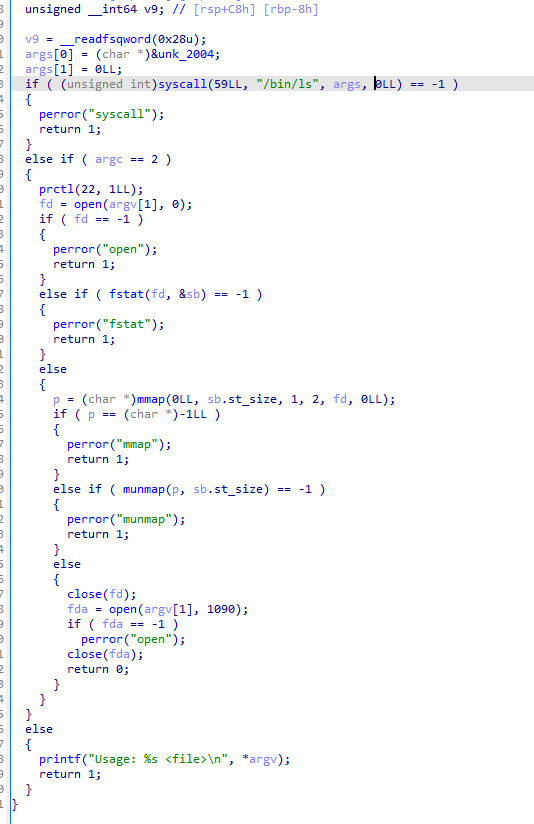
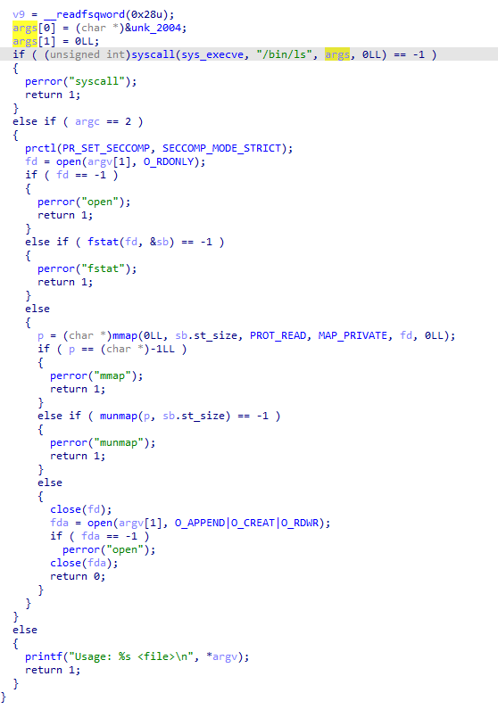

### AutoLibcFlags

DEAD PROJECT


AutoLibcFlags is a IDApro plugin that will automatically replace the flags in libc standard functions with enum.  
The plugin support also custom functions, See #Adding new functions. 
Only X64 is supported for the moment. 

All libc standard enum which are supported are in enum/ folder. 
Feel free to pull requests to add new functions.

## Preview
<p align="center">
  
  
</p>

## Install 

On Linux

```bash
git clone git@github.com:0xMirasio/IDALibcAutoFlags.git
cd IDALibcAutoFlags 
./install.sh
```

On Linux with Wine windows IDA

```bash
git clone git@github.com:0xMirasio/IDALibcAutoFlags.git
cd IDALibcAutoFlags 
USEWINE=1 ./install.sh
```

On Windows

```bash
git clone git@github.com:0xMirasio/IDALibcAutoFlags.git
cd IDALibcAutoFlags 
cmd.exe /c install.bat
```


## Usage

Press CTRL+Shit+Z to use plugins, nothing more ! (+F5 to refresh page for decompilation output)

## Add new functions

edit functions.json file.   
You need to add the following format:  
{"function_name": [ [index, register_associated_enum], [index, register_associated_enum], ...]}

For example, SendCrypto(&buf, &output, O_RDONLY, USE_SSL) -> the flags are on index 2 and 3. O_RDONLY come from 
fcntl.h and USE_SSL from customssl.h headers.  

We will have:  
{  
    "SendCrypto":   
        [2,"fcntl"],  
        [3, "customssl"]  
}   


You must create a enumFile in enum/ with the following format:  

1 USE_SSL

That's it ! 
You can also use the parseHeaders.py script in scripts for autoParse C header file and generate the corresponding file required.  
(Small modifications may be required, just a develloper helper script)  

## Bug and limitations 

Only x64 classical is supported for the moment. Bug and fails will occur on others platforms.

## Future work

x32 support
enum decomposition of flags : 0x3 => READ+WRITE(0x1 + 0x2)
